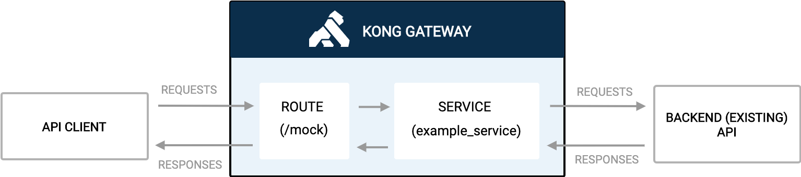

# Working with your first Service and Route

**Service:** In Kong, a Service represents a backend service or microservice that you want to expose through the API gateway. It encapsulates information about how to communicate with the actual service, including the service's URL, protocol, port, and other relevant details. Kong acts as a proxy for these services, handling requests and responses between clients and the backend services.

**Route:** A Route is a way to associate an incoming request with a specific Service.
It defines rules for how incoming requests should be processed and forwarded to the appropriate backend service.
A Route is essentially a mapping between a specific path or host and a Service. When a request matches the criteria specified in a Route, Kong forwards the request to the associated Service.



**Pre-requisite:** Kong Gateway up and running. 

## How to create a Service and Route in the UI

[Youtube video on creating a Service and Route](FIX)

## Video on how to create a Service and Route using Deck

[Youtube video on creating a Service and Route using Deck](FIX)

To install this using deck:

1. Navigate to this directory
2. Make sure you have deck [installed](https://docs.konghq.com/deck/latest/installation/)
3. Make sure you can connect: `deck gateway ping --headers Kong-Admin-Token:<token> --kong-addr http://<kong-admin-endpoint>` should return a successful response `Successfully connected to Kong! Kong version:  3.5.0.0`
4. Run deck sync: `deck gateway sync --headers Kong-Admin-Token:<token> --kong-addr http://<kong-admin-endpoint> kong.yaml`

## Deploy your first Service and Route using the Admin API

[Youtube video on creating a Service and Route using the Kongs Admin API]()


## Deploy your first Service and Route using KIC

[Youtube video on creating a Service and Route using KIC]()


**Pre-requisite**

Make sure you have Kong Ingress Controller installed and it's working. When running  `kubectl get svc,po -n kong` it should look something like below:

```
$  kubectl get po,svc -n kong
NAME                                          READY   STATUS      RESTARTS      AGE
pod/kong-kong-5b9f85dcf7-gtqvt                2/2     Running     6 (21h ago)   2d12h
pod/kong-kong-post-upgrade-migrations-5x6pj   0/1     Completed   0             2d12h
pod/kong-kong-pre-upgrade-migrations-rktkx    0/1     Completed   0             2d12h
pod/kong-postgresql-0                         1/1     Running     0             2d12h

NAME                                   TYPE           CLUSTER-IP     EXTERNAL-IP    PORT(S)                      AGE
service/kong-kong-admin                NodePort       10.80.15.21    <none>         8001:32488/TCP               2d12h
service/kong-kong-cluster              ClusterIP      10.80.7.37     <none>         8005/TCP                     2d12h
service/kong-kong-clustertelemetry     ClusterIP      10.80.10.87    <none>         8006/TCP                     2d12h
service/kong-kong-manager              NodePort       10.80.13.231   <none>         8002:30924/TCP               2d12h
service/kong-kong-proxy                LoadBalancer   10.80.10.58    <IP>   80:32035/TCP,443:32689/TCP   2d12h
service/kong-kong-validation-webhook   ClusterIP      10.80.3.0      <none>         443/TCP                      2d12h
service/kong-postgresql                ClusterIP      10.80.11.229   <none>         5432/TCP                     2d12h
service/kong-postgresql-hl             ClusterIP      None           <none>         5432/TCP                     2d12h
```

1. **Install Echo deployment:** `kubectl apply -f 1-create-echo.yaml`
2. **Add Ingress Resource:** `kubectl apply -f 2-echo-ingress.yaml`
3. **Proxy a request to your proxy endpoint**