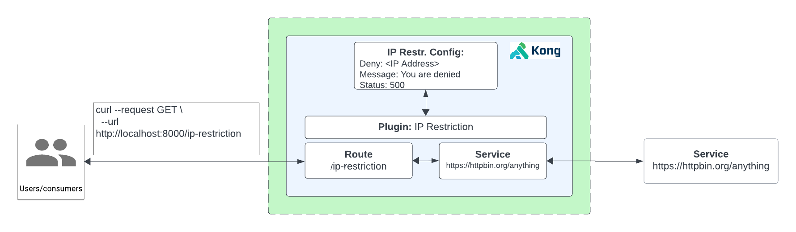

# How to use the Ip Restriction Plugin

- [How to use the Ip Restriction Plugin](#how-to-use-the-ip-restriction-plugin)
  - [What is IP Restriction?](#what-is-ip-restriction)
  - [Watch the video on how to use the ip-restriction plugin](#watch-the-video-on-how-to-use-the-ip-restriction-plugin)
  - [Installation using Deck](#installation-using-deck)
  - [Installation using KIC](#installation-using-kic)

## What is IP Restriction?

**IP Restriction:** allows businesses to control which IP addresses or ranges are allowed or denied access to the API. It can be used to whitelist trusted IPs or blacklist malicious IPs.

**How it works with Kong**

1. Create a Service and Route
2. Test to see if we can proxy request
3. Enable Kong’s IP Restriction Plugin to deny your IP address
4. Proxy to the endpoint, (plugin is now enabled) using insomnia or `curl http://<kong-proxy-endpoint>:<port>/ip-restriction`. Test to see if I can now access the API. you should get `Error. You are denied.` error message.



## Watch the video on how to use the ip-restriction plugin

<!--
[![First [PLUGIN NAME]](./images/activate.png)](https://youtu.be/ "First [PLUGIN NAME]")
-->

## Installation using Deck

To install this using deck:

1. Navigate to this directory
2. Make sure you have deck [installed](https://docs.konghq.com/deck/latest/installation/)
3. Make sure you can connect: `deck gateway ping --headers Kong-Admin-Token:<token> --kong-addr http://<kong-admin-endpoint>` should return a successful response `Successfully connected to Kong! Kong version:  3.5.0.0`
4. Run deck sync: `deck gateway sync --headers Kong-Admin-Token:kong --kong-addr http://<kong-admin-endpoint> --select-tag ip-restriction-example kong.yaml`
5. Proxy to the endpoint, (plugin is now enabled) using insomnia or `curl http://<kong-proxy-endpoint>:<port>/ip-restriction`. Test to see if I can now access the API. you should get `Error. You are denied.` error message.

## Installation using KIC

**Pre-requisite**

Make sure you have Kong Ingress Controller installed and it's working. When running  `kubectl get svc,po -n kong` it should look something simialar like below:

```
$  kubectl get po,svc -n kong
NAME                                          READY   STATUS      RESTARTS      AGE
pod/kong-kong-5b9f85dcf7-gtqvt                2/2     Running     6 (21h ago)   2d12h
pod/kong-kong-post-upgrade-migrations-5x6pj   0/1     Completed   0             2d12h
pod/kong-kong-pre-upgrade-migrations-rktkx    0/1     Completed   0             2d12h
pod/kong-postgresql-0                         1/1     Running     0             2d12h

NAME                                   TYPE           CLUSTER-IP     EXTERNAL-IP    PORT(S)                      AGE
service/kong-kong-admin                NodePort       10.80.15.21    <none>         8001:32488/TCP               2d12h
service/kong-kong-cluster              ClusterIP      10.80.7.37     <none>         8005/TCP                     2d12h
service/kong-kong-clustertelemetry     ClusterIP      10.80.10.87    <none>         8006/TCP                     2d12h
service/kong-kong-manager              NodePort       10.80.13.231   <none>         8002:30924/TCP               2d12h
service/kong-kong-proxy                LoadBalancer   10.80.10.58    34.41.87.189   80:32035/TCP,443:32689/TCP   2d12h
service/kong-kong-validation-webhook   ClusterIP      10.80.3.0      <none>         443/TCP                      2d12h
service/kong-postgresql                ClusterIP      10.80.11.229   <none>         5432/TCP                     2d12h
service/kong-postgresql-hl             ClusterIP      None           <none>         5432/TCP                     2d12h
```

1. **Install Echo deployment:** `kubectl apply -f 1-create-echo.yaml`
2. **Add Ingress Resource:** `kubectl apply -f 2-echo-ingress.yaml` 
3. **Note: `konghq.com/plugins: <plugin-name>` ingress annotation is already present for the plugin**
4. **Proxy to the endpoint:** Using insomnia or `curl http://<kong-proxy-endpoint>:<port>/<plugin-endpoint>`
5. **Add the plugin resource:** `kubectl apply -f 3-ip-restriction-plugin.yaml`
6. **Proxy to the endpoint**: (plugin is now enabled) using insomnia or `curl http://<kong-proxy-endpoint>:<port>/ip-restriction`. Test to see if I can now access the API. you should get `Error. You are denied.` error message.