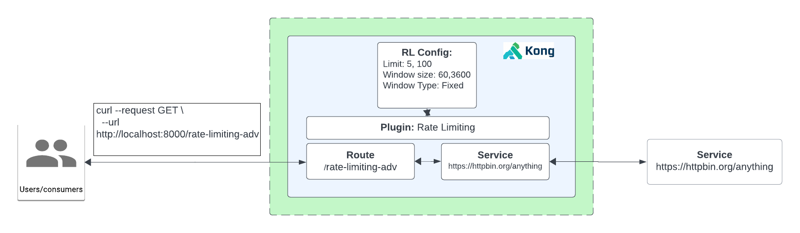

# How to Use the Rate Limiting Advanced Plugin

- [How to Use the Rate Limiting Advanced Plugin](#how-to-use-the-rate-limiting-advanced-plugin)
  - [What is the rate-limiting-advanced?](#what-is-the-rate-limiting-advanced)
  - [Watch the video on how to use the rate-limiting-advanced plugin](#watch-the-video-on-how-to-use-the-rate-limiting-advanced-plugin)
  - [Installation using Deck](#installation-using-deck)
  - [Installation using KIC](#installation-using-kic)

## What is the rate-limiting-advanced?

**Rate Limiting Advanced** in Kong goes beyond basic rate limiting by allowing for more complex policies and rate limiting based on various factors such as HTTP headers, query parameters, or user roles. It enables conditional rate limiting, which means different clients or requests can have different rate limits based on their characteristics.

**How it works with Kong**

1. Create a Service and Route
2. Test to see if we can proxy request
3. Inspect headers
4. Enable Kong’s Rate Limiting Advanced Plugin
5. Test my sending multiple requests




## Watch the video on how to use the rate-limiting-advanced plugin

<!--
[![First [PLUGIN NAME]](./images/activate.png)](https://youtu.be/ "First [PLUGIN NAME]")
-->

## Installation using Deck

To install this using deck:

1. Navigate to this directory
2. Make sure you have deck [installed](https://docs.konghq.com/deck/latest/installation/)
3. Make sure you can connect: `deck gateway ping --headers Kong-Admin-Token:<kong-token> --kong-addr http://<kong-admin-endpoint>` should return a successful response `Successfully connected to Kong! Kong version:  3.5.0.0`
4. Run deck sync: `deck gateway sync --headers Kong-Admin-Token:kong --kong-addr http://<kong-admin-endpoint> --select-tag rate-limiting-adv-example kong.yaml `

## Installation using KIC

**Pre-requisite**

Make sure you have Kong Ingress Controller installed and it's working. When running  `kubectl get svc,po -n kong` it should look something similar like below:

```
$  kubectl get po,svc -n kong
NAME                                          READY   STATUS      RESTARTS      AGE
pod/kong-kong-5b9f85dcf7-gtqvt                2/2     Running     6 (21h ago)   2d12h
pod/kong-kong-post-upgrade-migrations-5x6pj   0/1     Completed   0             2d12h
pod/kong-kong-pre-upgrade-migrations-rktkx    0/1     Completed   0             2d12h
pod/kong-postgresql-0                         1/1     Running     0             2d12h

NAME                                   TYPE           CLUSTER-IP     EXTERNAL-IP    PORT(S)                      AGE
service/kong-kong-admin                NodePort       10.80.15.21    <none>         8001:32488/TCP               2d12h
service/kong-kong-cluster              ClusterIP      10.80.7.37     <none>         8005/TCP                     2d12h
service/kong-kong-clustertelemetry     ClusterIP      10.80.10.87    <none>         8006/TCP                     2d12h
service/kong-kong-manager              NodePort       10.80.13.231   <none>         8002:30924/TCP               2d12h
service/kong-kong-proxy                LoadBalancer   10.80.10.58    <ip-Address>   80:32035/TCP,443:32689/TCP   2d12h
service/kong-kong-validation-webhook   ClusterIP      10.80.3.0      <none>         443/TCP                      2d12h
service/kong-postgresql                ClusterIP      10.80.11.229   <none>         5432/TCP                     2d12h
service/kong-postgresql-hl             ClusterIP      None           <none>         5432/TCP                     2d12h
```

1. **Install Echo deployment:** `kubectl apply -f 1-create-echo.yaml`
2. **Add Ingress Resource:** `kubectl apply -f 2-echo-ingress.yaml` 
3. **Note: `konghq.com/plugins: rate-limiting-adv-plugin` ingress annotation is already present for the plugin**
4. **Proxy to the endpoint:** Using insomnia or `curl http://<kong-proxy-endpoint>:<port>/rate-limit-adv`
5. **Add the plugin resource:** `kubectl apply -f 3-rate-limiting-adv-plugin.yaml`
6. **Proxy to the endpoint, plugin is now enabled. If you send more than 5 requests in a minute. A rate limit will be applied:** Using insomnia or `curl http://<kong-proxy-endpoint>:<port>/rate-limit-adv`. Response will look like this `{"message":"API rate limit exceeded"}`