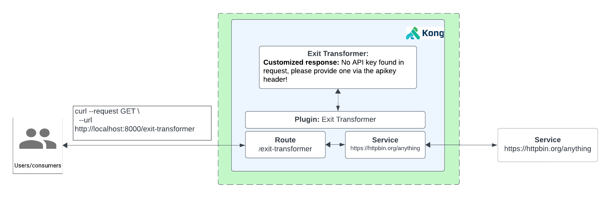

# How to use the exit-transformer Plugin

- [How to use the exit-transformer Plugin](#how-to-use-the-exit-transformer-plugin)
  - [What is the Exit Transformer plugin?](#what-is-the-exit-transformer-plugin)
  - [Watch the video on how to use the exit-transformer plugin](#watch-the-video-on-how-to-use-the-exit-transformer-plugin)
  - [Installation using Deck](#installation-using-deck)
  - [Installation using KIC](#installation-using-kic)

IMPORTANT: [untrusted-lua](https://docs.konghq.com/gateway/latest/reference/configuration/#untrusted_lua) must be set to either on or sandbox in your kong configuration file for this plugin to work. The default value is sandbox, which means that Lua functions are allowed, but will be executed in a sandbox which has limited access to the Kong global environment.

## What is the Exit Transformer plugin?

Transform and customize Kong Gateway response exit messages using Lua functions. The plugin’s capabilities range from changing messages, status codes, and headers, to completely transforming the structure of Kong Gateway responses.

**How to do it with Kong**

1. Create a Service and Route
2. Test to see if we can proxy a request
3. Enable Kong’s Key Authentication Plugin
4. Try to access the API now. We will not be able to access the API. You will get a error message back like below:

```
{
	"message": "No API key found in request",
	"request_id": "9291b854245e0c082997a74cfee7575d"
}
```


5. Enable the custom exit transformer
6. Test by calling the proxy, you will get a customized response saying:

```
{
	"message": "No API key found in request, please provide one via the apikey header!",
	"error": true,
	"status": 401
}
```

## Watch the video on how to use the exit-transformer plugin

<!--
[![First [PLUGIN NAME]](./images/activate.png)](https://youtu.be/ "First [PLUGIN NAME]")
-->

## Installation using Deck

To install this using deck:

1. Navigate to this directory
2. Make sure you have deck [installed](https://docs.konghq.com/deck/latest/installation/)
3. Make sure you can connect: `deck gateway ping --headers Kong-Admin-Token:<token> --kong-addr http://<kong-admin-endpoint>` should return a successful response `Successfully connected to Kong! Kong version:  3.5.0.0`
4. Run deck sync: `deck gateway sync --headers Kong-Admin-Token:kong --kong-addr http://<kong-admin-endpoint> --select-tag exit-transformer-example kong.yaml`



## Installation using KIC

**Pre-requisite**
exit-trans.pngk
Make sure you have Kong Ingress Controller installed and it's working. When running  `kubectl get svc,po -n kong` it should look something similar like below:

```
$  kubectl get po,svc -n kong
NAME                                          READY   STATUS      RESTARTS      AGE
pod/kong-kong-5b9f85dcf7-gtqvt                2/2     Running     6 (21h ago)   2d12h
pod/kong-kong-post-upgrade-migrations-5x6pj   0/1     Completed   0             2d12h
pod/kong-kong-pre-upgrade-migrations-rktkx    0/1     Completed   0             2d12h
pod/kong-postgresql-0                         1/1     Running     0             2d12h

NAME                                   TYPE           CLUSTER-IP     EXTERNAL-IP    PORT(S)                      AGE
service/kong-kong-admin                NodePort       10.80.15.21    <none>         8001:32488/TCP               2d12h
service/kong-kong-cluster              ClusterIP      10.80.7.37     <none>         8005/TCP                     2d12h
service/kong-kong-clustertelemetry     ClusterIP      10.80.10.87    <none>         8006/TCP                     2d12h
service/kong-kong-manager              NodePort       10.80.13.231   <none>         8002:30924/TCP               2d12h
service/kong-kong-proxy                LoadBalancer   10.80.10.58    34.41.87.189   80:32035/TCP,443:32689/TCP   2d12h
service/kong-kong-validation-webhook   ClusterIP      10.80.3.0      <none>         443/TCP                      2d12h
service/kong-postgresql                ClusterIP      10.80.11.229   <none>         5432/TCP                     2d12h
service/kong-postgresql-hl             ClusterIP      None           <none>         5432/TCP                     2d12h
```

1. **Install Echo deployment:** `kubectl apply -f 1-create-echo.yaml`
2. **Add Ingress Resource:** `kubectl apply -f 2-echo-ingress.yaml` 
3. **Note: `konghq.com/plugins: key-auth-plugin,exit-transformer` ingress annotations are already present for the plugin**
4. **Add the plugin resource:** `kubectl apply -f 3-key-auth-plugin.yaml`
5. **Proxy to the endpoint:** Using insomnia or `curl http://<kong-proxy-endpoint>:<port>/exit-transformer`. You will get the following response:

```
{
	"message": "No API key found in request",
	"request_id": "9291b854245e0c082997a74cfee7575d"
}
```

6. **Add the Exit transfomer plugin resource:** `kubectl apply -f 4-exit-transformer-plugin.yaml`
7. **Proxy to the endpoint, plugin is now enabled:** Using insomnia or `curl http://<kong-proxy-endpoint>:<port>/exit-transformer` . You should now get the following response: 


```
{
	"message": "No API key found in request, please provide one via the apikey header!",
	"error": true,
	"status": 401
}
```